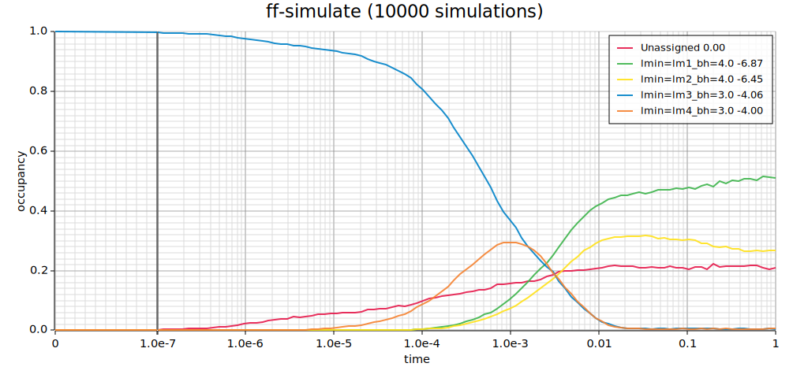

# Analyze changes of secondary-structure ensembles over time

## Input files

The file `dld3.fa` contains a designed RNA sequence and can be used to start
simulations from the **open-chain configuration**:

```fasta
>dld3.fa
UCAGUCUUCGCUGCGCUGUAUCGAUUCGGUUUCAGUUUUUAUUGC
```

If you want to start simulations in a specific **folded structure**, provide
that structure explicitly.  For example, the file `dld3_lm3.fa` defines an
initial conformation:

```fasta
>dld3
UCAGUCUUCGCUGCGCUGUAUCGAUUCGGUUUCAGUUUUUAUUGC
.((((....)))).((((........))))...............
```

*(The file name itself is arbitrary but indicates that this structure
corresponds to 'local minimum 3'.)*

---

### Macro-states

To partition the overall secondary-structure ensemble into smaller ensembles of
interest, we define **macro-states** using files such as `dld3_lm*.ms`.

Example (`dld3_lm3.ms`):

```fasta
>lmin=lm3_bh=3.0
UCAGUCUUCGCUGCGCUGUAUCGAUUCGGUUUCAGUUUUUAUUGC
.((((....)))).((((........))))...............
.((((....)))).((((.(....).))))...............
.((((....))))..(((........)))................
.((((....)))).((((.(.....)))))...............
.(((......))).((((........))))...............
..(((....)))..((((........))))...............
.(((......)))..(((........)))................
.(((.(...)))).((((........))))...............
```

Here:
- The first line defines the **macro-state name** (`lmin=lm3_bh=3.0`).
- The second line specifies the **sequence**.
- The remaining lines list all **secondary structures** that belong to this macro-state.

Note that the starting structure from `dld3_lm3.fa` is part of this macro-state.

---

## Simulation setup

> **Note:** Ensure the `fuzzyfold` package is installed.  
> When working directly from the Git repository, use  
> ```bash
> cargo run --bin ff-timecourse -- [options]
> ```  
> instead of calling `ff-timecourse` directly.

To simulate 100 trajectories starting in a specific lm3 conformation:

```bash
cat dld3_lm3.fa | ff-timecourse --macrostates dld3*.ms --t-log 100 --t-ext 1e-7 --t-end 0.1 -n 100
```

or equivalently:

```bash
ff-timecourse --macrostates dld3*.ms --t-log 100 --t-ext 1e-7 --t-end 0.1 -n 100 < dld3_lm3.fa
```

Use:

```bash
ff-timecourse --help
```

to familiarize yourself with timeline parameters such as `--t-log`, `--t-ext`, and `--t-end`.

During execution, the program prints simulation parameters to `STDOUT`,
displays a **progress bar**, and outputs **time-course data** once all runs are
completed.  The time course is also plotted automatically as an SVG file, for
example:

```
ff_dld3.svg
```

where the plot name is derived from the input file.

---

## Aggregating data from multiple simulations

To reduce statistical noise in ensemble dynamics, you may want to perform
**many more trajectories**, potentially for longer time periods.  You can
*accumulate results incrementally* by reloading existing timelines.

For example:

```bash
cat dld3_lm3.fa | ff-timecourse --macrostates dld3*.ms --t-log 100 --t-ext 1e-7 --t-end 1 -n 100 --timeline my_dld3.tln
```

This command creates `my_dld3.tln`, which stores the results from 100
simulations.  Running the same command again will automatically reload the
file, add another 100 simulations, and update the stored timeline accordingly.

Try it — this is the recommended way to extend your simulation dataset without
restarting from scratch.

An example output file from $10^4$ aggregated simulations of 1-second runs may look like this:



