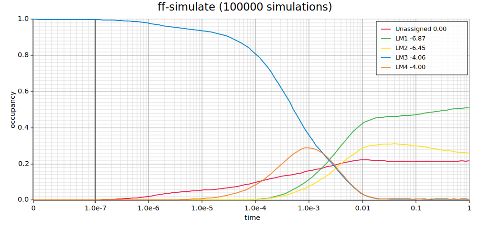

# Analyze changes of secondary-structure ensembles over time

## Input files

The file `dld3.fa` contains a designed RNA sequence and can be used to start
simulations from the **open-chain configuration**:

```fasta
>dld3.fa
UCAGUCUUCGCUGCGCUGUAUCGAUUCGGUUUCAGUUUUUAUUGC
```

If you want to start simulations in a specific **folded structure**, provide
that structure explicitly.  For example, the file `dld3_lm3.fa` defines an
initial conformation:

```fasta
>dld3
UCAGUCUUCGCUGCGCUGUAUCGAUUCGGUUUCAGUUUUUAUUGC
.((((....)))).((((........))))...............
```

*(The file name itself is arbitrary but indicates that this structure
corresponds to 'local minimum 3'.)*

---

### Macro-states

To partition the overall secondary-structure ensemble into smaller ensembles of
interest, we define **macro-states** using files such as `dld3_lm*.ms`.

Example (`dld3_lm3_3.0.ms`):

```fasta
>LM3 lmin=lm3_bh=3.0
UCAGUCUUCGCUGCGCUGUAUCGAUUCGGUUUCAGUUUUUAUUGC
.((((....)))).((((........))))...............
.((((....)))).((((.(....).))))...............
.((((....))))..(((........)))................
.((((....)))).((((.(.....)))))...............
.(((......))).((((........))))...............
..(((....)))..((((........))))...............
.(((......)))..(((........)))................
.(((.(...)))).((((........))))...............
```

Here:
- The first line defines the **macro-state name** (`LM3`) and, optionally, some more description after a white-space (`lmin=lm3_bh=3.0`).
- The second line specifies the **sequence**.
- The remaining lines list all **secondary structures** that belong to this macro-state.

Note that the starting structure from `dld3_lm3.fa` is part of this macro-state.

---

## Simulation setup

To simulate 100 trajectories starting in a specific lm3 conformation:

```bash
cat dld3_lm3.fa | ff-timecourse --macrostates dld3*.ms --t-end 0.1 -n 100 --output dld3_lm3 
```

or equivalently:

```bash
ff-timecourse --macrostates dld3*.ms --t-end 0.1 -n 100 --output dld3_lm3_t0.1 < dld3_lm3.fa
```

To familiarize yourself with the default timeline parameters `--t-lin`, `--t-log`,
and `--t-ext` for output analysis, see:

```bash
ff-timecourse --help
```

During execution, the program prints simulation parameters to `STDOUT`,
displays a **progress bar**, and outputs **time-course data** once all runs are
completed.  The time course is also plotted automatically as an SVG file, 
where the plot name is derived from the input file. For example:

```
dld3_lm3_t0.1.svg
```

---

## Aggregating data from multiple simulations

To reduce statistical noise in ensemble dynamics, you may want to perform
**many more trajectories**, potentially for longer time periods.  You can
*accumulate results incrementally* by reloading existing timelines.
In fact, this happens **automatically**, if a `*.tln` file exists that 
matches your `--output name`. Note, timelines can only be merged, if the 
timeline parameters do not change between calls!

For example:

```bash
cat dld3_lm3.fa | ff-timecourse --macrostates dld3*.ms --t-end 1 -n 100 --output dld3_t100.tln
```

This command creates `dld3_t100.tln`, which stores the results from 100
simulations.  Running the same command again will automatically reload the
file, add another 100 simulations, and update the stored timeline accordingly.

Try it! This is the recommended way to extend your simulation dataset without
restarting from scratch.

An example output file from $10^5$ aggregated simulations of 1-second runs may look like this:



